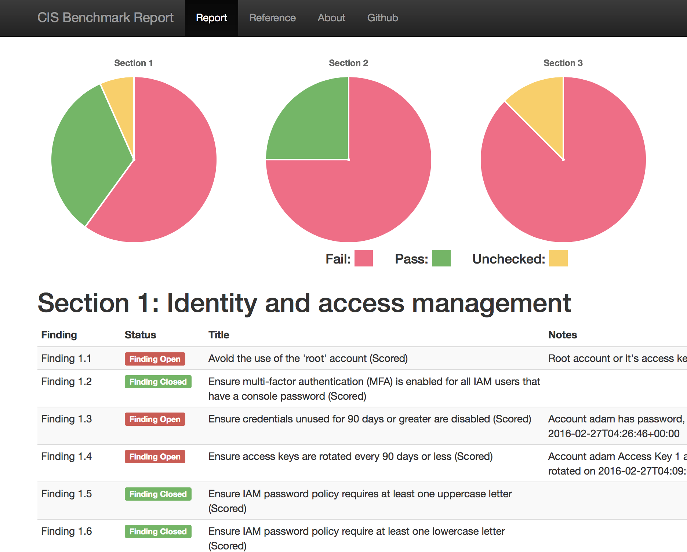

# AWS CIS Benchmark Scanner

This scanner assesses your AWS Account for compliance with the [CIS Benchmark](https://d0.awsstatic.com/whitepapers/compliance/AWS_CIS_Foundations_Benchmark.pdf) for AWS.  The content is using the Benchmark Version 1.0.0 - 02-29-2016.

Use the `-r` or `-region` flags to tell the scanner which region to use for non-commercial / generally available regions (such as GovCloud or China).  All commercial regions (as of September 5, 2016) are supported.  AWS US GovCloud (`us-gov-west-1`) region is supported as well.  AWS China (Beijing - `cn-north-1`) is NOT yet supported (I have no way to test in CN region, and it's missing a few of the required services, such as MFA support).  AWS C2S region is also unsupported (due to lack of support in SDK).

An example output file is included at [report.html](report.html)

Downloads are in the [bin/](bin/) directory.

Examples:

## Usage
The scanner will use your ~/.aws/credentials and/or ~/.aws/config files for access keys automatically.

It will also respect environment variables/etc - it is built with the AWS SDK, so all of that should work.
Examples:

`username@host$ aws-cis-scanner > report.html`

or

`username@host$ aws-cis-scanner -r us-gov-west-1 > report.html`

## Permissions Required

This scanner requires the following (read only) API permissions:
###API Calls Used:
###IAM
  * iam.GenerateCredentialReport
  * iam.GetCredentialReport
  * iam.GetAccountPasswordPolicy
  * iam.ListUserPolicies
  * iam.ListAttachedUserPolicies
###Cloud Trail
  * ct.DescribeTrails
  * ct.GetTrailStatus
###S3
  * s3.GetBucketAcl
  * s3.GetBucketPolicy
  * s3.GetBucketLogging
###Config
  * cs.DescribeConfigurationRecorders
###KMS
  * kms.ListKeys
  * kms.GetKeyRotationStatus
###Cloudwatch Logs
  * cwlogs.DescribeMetricFilters
###SNS
  * sns.ListSubscriptionsByTopic
###Cloud Watch
  * cw.DescribeAlarmsForMetric
###EC2
  * ec2.DescribeSecurityGroups
  * ec2.DescribeFlowLogs

## Legal
This work is licensed under a Creative Commons Attribution-NonCommercial-ShareAlike 4.0 International Public License. The link to the license terms can be found at https://creativecommons.org/licenses/by-nc-sa/4.0/legalcode

## Notes
**This scanner currently features very little error checking or recovery, and works through checks linearly.**

Please feel free to open issues (and include any output/stack trace), or submit PRs.

Finally, this was a project designed to help me learn the Go language, so, sorry if the code makes your eyes bleed, I'm sure it's highly non-idiomatic.

For more info, contact the author @ adam[at]stigian.com
